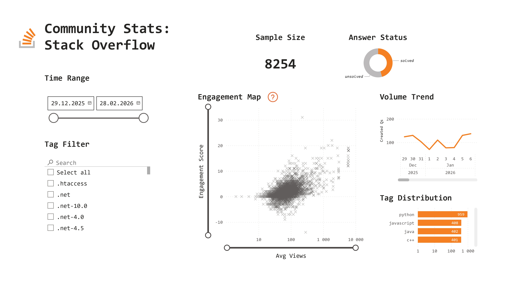

# Stack Overflow Data Pipeline & Analytics


An end-to-end data engineering and analytics project that extracts developer activity data from the Stack Exchange API, models it in a PostgreSQL database, and visualizes global technology trends using Power BI.



## 📌 Project Overview

The goal of this project is to track and analyze community engagement across various programming languages and technologies on Stack Overflow. It features an ETL pipeline that handles pagination, API rate limits, and data loading into a locally hosted Docker container.

## 🛠 Tech Stack

* **Language:** Python 3.10+
* **Libraries:** `requests`, `psycopg[binary]`, `python-dotenv`
* **Infrastructure:** Docker, PostgreSQL
* **BI & Analytics:** Power BI, DAX

## 🏗 Architecture & Key Features

**1. API Extraction:** 
* Custom Python client interacting with the Stack Exchange API.
* Built-in session management and automatic `backoff` handling to respect API rate limits.


**2. Database Modeling:**
   * Data is loaded into a PostgreSQL database running in a Docker container.
   * Modeled with a central `fact_questions` table and a bridge table to handle many-to-many tag relationships (`bridge_question_tags`).
   * Implements `UPSERT` (ON CONFLICT DO UPDATE) logic to prevent data duplication during incremental loads.
   

**3. BI Dashboard:**
* Custom **Date Dimension** table created with DAX for multi-level time-series analysis.
* Logarithmic scale visualizations for unbiased tag distribution analysis.
* Custom **Engagement Score** metric designed to evaluate the quality of discussion (balancing net score and answer counts).


## 🚀 How to Run Locally

### 1. Prerequisites

* Docker and Docker Compose installed.
* Python 3.10+ installed.
* Get a free API key from [Stack Apps](https://stackapps.com/).

### 2. Setup Infrastructure

Clone the repository and spin up the PostgreSQL database:

```bash
git clone https://github.com/holovata/stackoverflow-analytics-pipeline.git
cd stackoverflow-pipeline
docker-compose up -d

```

### 3. Environment Variables

Create a `.env` file in the root directory and add your credentials:

```text
# Local Database (matches docker-compose.yml)
POSTGRES_USER=stack_user
POSTGRES_PASSWORD=stack_password
POSTGRES_DB=stack_analytics
POSTGRES_HOST=localhost
POSTGRES_PORT=5433

# API Credentials
STACK_API_KEY=your_api_key_here
STACK_FILTER=!nNPvSNdWme

```

### 4. Install Dependencies & Run ETL

Create a virtual environment and run the pipeline:

```bash
python -m venv venv
source venv/bin/activate  # On Windows use: venv\Scripts\activate
pip install -r requirements.txt

```
**Running the Data Extraction:**
The script allows you to configure the extraction period and volume using command-line arguments.

* `--start`: The beginning of the extraction period (Format: `YYYY-MM-DD`).
* `--end`: The end of the extraction period (Format: `YYYY-MM-DD`). Defaults to today.
* `--pages`: The Stack Exchange API uses pagination, returning 100 questions per page. This parameter sets the maximum number of pages to download. For example, `--pages 10` will fetch up to 1,000 questions within your date range.

**Examples:**

```bash
# Run with default settings (from Dec 1, 2025 to present, 80 pages / ~8000 items)
python src/main.py

# Extract data for a specific month (e.g., January 2026, up to 5000 items)
python src/main.py --start 2026-01-01 --end 2026-01-31 --pages 50
```


### 5. View the Dashboard

Open the `stack_overflow_visualization.pbix` file in Power BI Desktop and click **Refresh** to load the data from your local PostgreSQL database.
